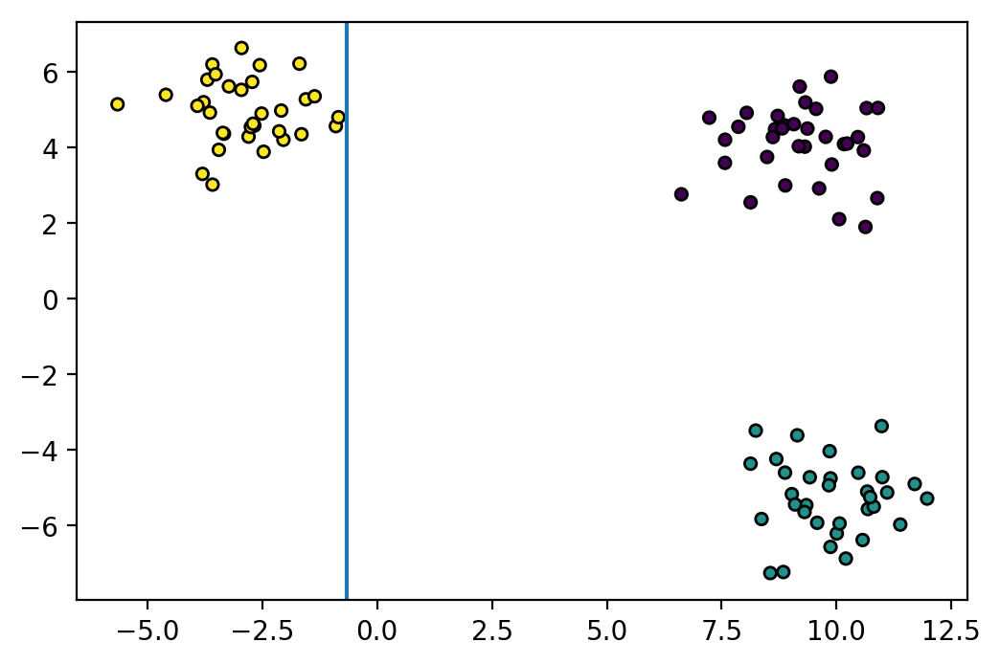
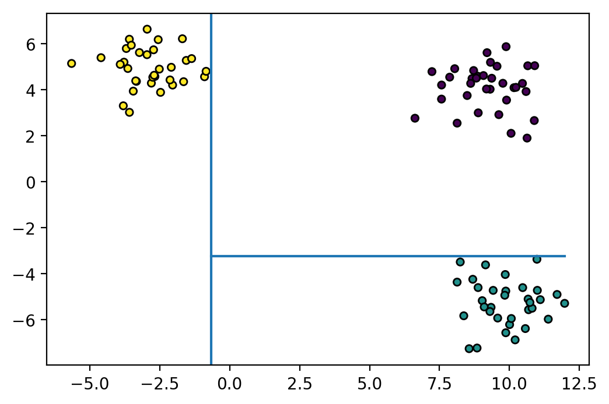

\newpage

# Machine Learning

## What is Machine Learning?

Machine learning is a subject typically considered part of computer science. It
involves the development of flexible algorithms that can
_learn patterns from data_. These learned patterns can then help understand
inherent patterns in the data (_unsupervised learning_) or make predictions on
a target using the learned patterns/relationships (_supervised learning_).

What do we mean when we say "learn patterns from data"? Let's start with a
picture.


```python
import numpy as np
import sklearn
import matplotlib.pyplot as plt
from sklearn.datasets import make_blobs

x1, y1 = make_blobs(n_features = 2, centers = 3, random_state=24)
plt.scatter(x1[:,0], x1[:,1], marker='o', c=y1, s=20, edgecolor='k')
plt.show()
```

\

Visually, it is clear that there are 3 groups of observations here, each with a different color.
The computer has to learn to figure this out. Since there is clear separation
of the groups, this is perhaps not so hard, but might teach us how to make
the computer learn.

First, let's see if we can have the computer learn a vertical line that would
let everything to its left will be yellow. This is visually an easy task. Let's see how we
can make the computer learn this using Python. First, the colors are coded numerically
in Python as follows:

+ black = 0
+ blue = 1
+ yellow = 2

The following code instructs the computer to construct 100 points along the
x-axis, then ask for the first time when all the points to the left of one of
these points is yellow, and no point on the other side is yellow. We then draw
that line.

```python
test_x = np.linspace(np.min(x1[:,0]), np.max(x1[:,0]), 100)
candidate_x = -5
for x in test_x[1:-1]:
  yellow_to_right = (y1[x1[:,0] > x] == 2)
  if np.sum(yellow_to_right)==0:
    candidate_x = x
    break

plt.scatter(x1[:,0], x1[:,1], marker='o', c=y1, s=20, edgecolor='k')
plt.axvline(x=candidate_x)
plt.show()
```

\

Look, the computer learned something. It learned that points with the x-value < -0.66
are yellow.

Now, lets see if we can have the computer learn to discover where the blue points
are among the non-yellow points.  We'll use very similar code as above.


```python
test_y = np.linspace(np.min(x1[:,1]), np.max(x1[:,1]), 100)
# restrict to data to the right of -0.66
x2 = x1[x1[:,0] > candidate_x, :]
y2 = y1[x1[:,0] > candidate_x]
candidate_y = -10
for y in test_y[1:-1]:
  blue_below = (y2[x2[:,1] > y] == 1)
  if np.sum(blue_below)==0:
    candidate_y = y
    break

plt.scatter(x1[:,0], x1[:,1], marker='o', c=y1, s=20, edgecolor='k')
plt.axvline(x = candidate_x)
plt.plot([candidate_x, np.max(x1[:,0])], [candidate_y+0.1, candidate_y+0.1])
plt.show()
```

\

This time, the computer learned, among the non-yellow points,
if y-values are less than -3.33, they are blue. Knowing we have only three colors,
we know the rest are black.

So the computer learned the following from this process:

Rule                               Outcome
---------------------------------  -----------
x-value < -0.66                    yellow
x-value > -0.66, y-value < -3.33   blue
x-value > -0.66, y-value > -3.33   black

This is called __training the algorithm__, in that the computer is trained from the data it saw to
call the color of the data based on x and y values. Now, if the computer is given new
(x,y) data, it will predict its color following the table above. This is the  _prediction rule_
that the algorithm will use on new data.

### Summary
