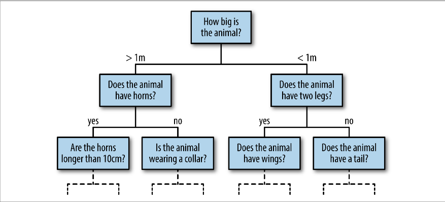
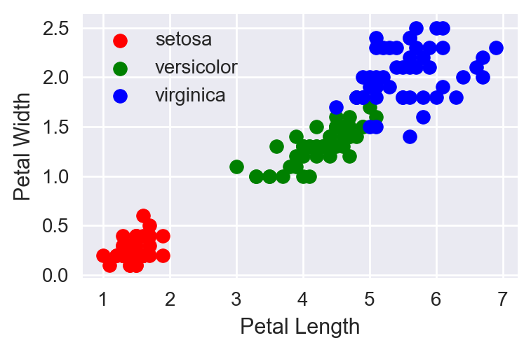
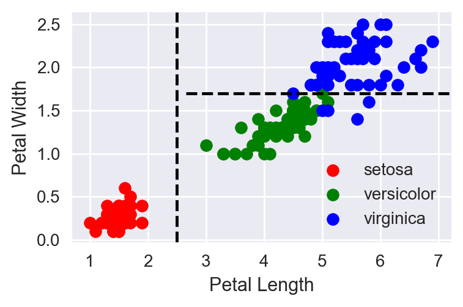
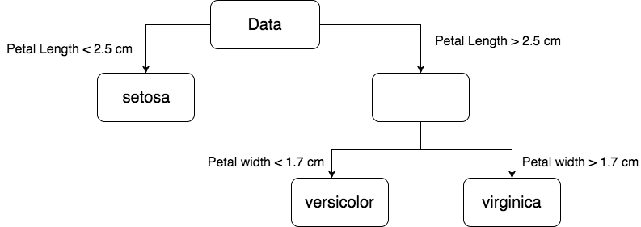

# Decision Trees

## Decision Trees

+ Decision trees (nominally) are flowcharts of a decision-making process



At the bottom nodes are the predicted outcomes

# Decision Trees in Machine Learning

---

+ Decision Trees are a form of supervised learning
  - Data is in the form of predictors and a target
  - The target can be continuous (e.g., credit risk) or categorical (e.g. risk categories)
  - Objective is to predict the target from the predictors

## What do we want a learning machine to learn?

+ If I get values for a set of predictors
+ I want to know a prediction of the target for that multivariate predictor value
+ I want this prediction to be as accurate as possible

> Petal Length = 2 cm, Petal Width = 0.4 cm    
Prediction: setosa

> Petal Length = 4 cm, Petal Width = 1 cm    
Prediction: versicolor

## What do we want a learning machine to learn?

+ So I want some kind of rule for prediction
+ I want the learning machine to derive/estimate this rule from data
+ I want the best possible (most accurate) rule

# A motivating example

## Let's motivate the idea 



## Let's motivate the idea



## A rule

```{r, echo=F}
suppressPackageStartupMessages(library(tidyverse))
d <- tibble(`Petal Length` = c('< 2.5 cm','> 2.5 cm','> 2.5 cm'),
            `Petal Width` = c('', '< 1.7 cm','> 1.7 cm'),
            `Prediction` = c('setosa','versicolor','virginica'))
knitr::kable(d)
```

## A decision tree



## Python 

```python
iris = sns.load_dataset('iris')
# iris = pd.read_csv('iris.csv')
iris['Prediction'] = ''
iris.loc[iris['petal_length'] < 2.5, 'Prediction'] = 'setosa'
iris.loc[(iris['petal_length'] > 2.5) & (iris['petal_width'] < 1.7), 'Prediction'] = 'versicolor'
iris.loc[(iris['petal_length'] > 2.5) & (iris['petal_width'] > 1.7),'Prediction'] = 'virginica'
pd.crosstab(iris['species'], iris['Prediction'])

from sklearn.metrics import accuracy_score
accuracy_score(iris['species'],iris['Prediction'])
```

# What would a machine need?

## The basic process

Let's agree to only binary splits for one variable each time.

Let's also agree that we are classifying (i.e. we have discrete label)

We would need:

1. A criterion for splitting
2. Determining when not to split any more (terminal node)
3. Splitting recursively to build a tree
4. A way to make a prediction from new data

# A criterion for splitting

## The Gini index

The Gini index is a measure of the class-purity of a group.

How homogeneous is the group?

If it's homogeneous (all have the same label) we don't need to split it further.

## The Gini index {center=false}

- If our data has _k_ labels {1,2, ..., K}, let $P(label = k) = p_k$. 

$$
\begin{eqnarray*}
GI &=& \sum_{k = 1}^K p_k(1-p_k)\\
&=& 1 - \sum_{k=1}^K p_k^2
\end{eqnarray*}
$$

## Gini Index

$$
GI = 1 - \sum_k p_k^2
$$

Group 1 = {red, red}, Group 2 = {blue, blue} -> GI~1~ = ?, GI~2~ = ? 

Group 1 = {red, blue}, Group 2 = {blue, red} -> GI~1~ = ?, GI~2~ = ?

## When do we decide to split the data

We split the data where the   
__frequency-weighted sum of Gini indices__    
for the split is smallest.

## When do we decide to split the data?

If parent node has _n_ rows, and the split groups have _n~1~_ and _n~2~_ rows then

$$
GI = GI_1\times \frac{n_1}{n} + GI_2 \times \frac{n_2}{n}
$$

# Splitting the data

## Splitting the data
For each value of each predictor, we

1. Split the data into a left and a right group at that value
2. Compute the Gini index for the split
3. Choose that combination of predictor and value that has the smallest Gini index

# Build a tree

## How to build a tree

1. Calling terminal nodes
2. Recursive splitting
3. Grow the tree

## Terminal nodes

- Node is homogeneous 
- It is below the minimum number of records required for a split (user-supplied)
- The tree has grown to maximum depth (user-supplied)

At a terminal node, the prediction will be the most popular class in the node

## Recursive splitting

1. We call our splitting algorithm over and over from the top
2. At each stage we will call a node either terminal or split-worthy
3. If a node is split-worthy, we split it again
4. We stop when all nodes are terminal

## Building the tree

1. Start at the root node
2. Call our splitting function recursively until the whole tree is built

# Make a prediction

## Predicting a class label

1. Determine which terminal node the new datum falls in
2. Find the prediction for that terminal node

