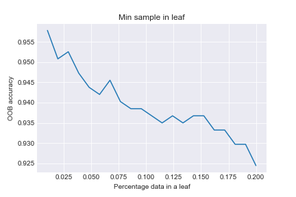
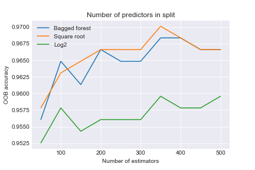
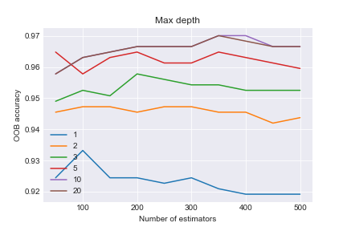
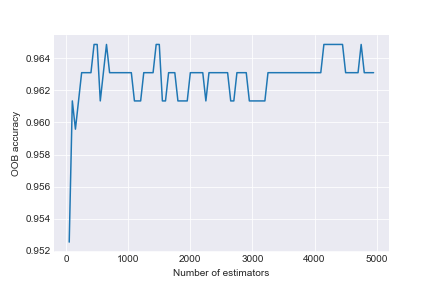
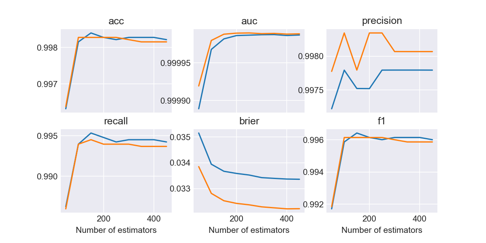

# Random Forest

## Random Forest

Random Forests are 

+ bagged decision trees where
+ a random subset of predictors is used for each split

## Random Forests

There are four main parameters for a random forest:

1. Number of estimators (bootstrap samples)
2. Proportion of predictors to use at each split (`max_features`)
3. Depth of each tree (`max_depth`)
4. Minimum sample size at each terminal node (`min_sample_leaf`)

## min_sample_leaf

## max_features

## max_depth

## Number of estimators

# Feature importance and selection

## Feature importance

By default, RandomForestClassifier gives the improvement in Gini Index due to splitting on a 
predictor as the feature importance

+ It is influenced by the number of categories in each variable

## Permutation importance

The permutation importance is better, but not directly implemented

See implementation in script

## Feature importance in general

+ One at a time
+ Can be influenced by collinearity/dependence
  + Features which are collinear will tend to depress each others' importance score
+ Can be influenced by granularity of the predictor
  + Features with more levels are more likely to be "important"
  
## Variable selection

+ Use cross-validation and backward selection to optimize model

# Taking advantage of bagging

+ Use indvidual estimators to get an idea about variability
  + Prediction intervals for each individual prediction
  + Confidence intervals for feature importance measures
  
## An exploration of different metrics

1. Accuracy : What proportion of predictions are correct
2. Precision: What proportion of positives are true
3. Recall: What proportion of true positives are called positive
4. AUC : Area under the receiver operating characteristic (ROC) curve
  + ROC maps (1-specificity) against sensitivity for different cutoffs
  + Sensitivity = Recall
  + Specificity = What proportion of true negatives are called negative
5. F1 score: harmonic mean of Precision and Recall
6. Brier score: Mean squared error of probability predictions

## Probability predictions

You can get probability predictions from random forest classifiers

Proportion of '1' calls for each point

## Probability predictions

For binary outcomes, you can also get probability predictions from random forest regressors

## Performance

# Stacking

